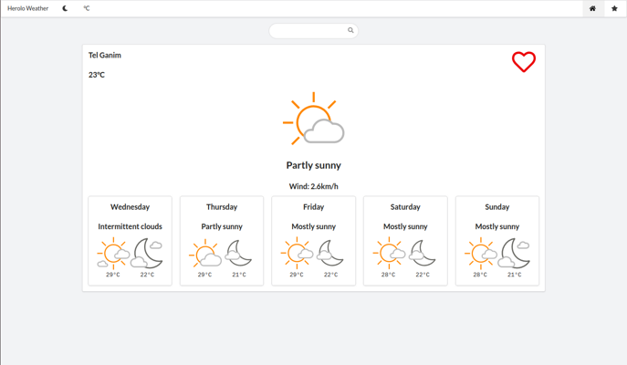
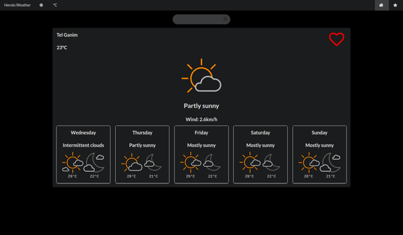
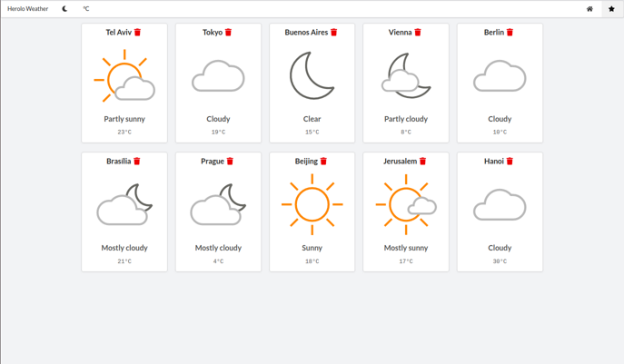
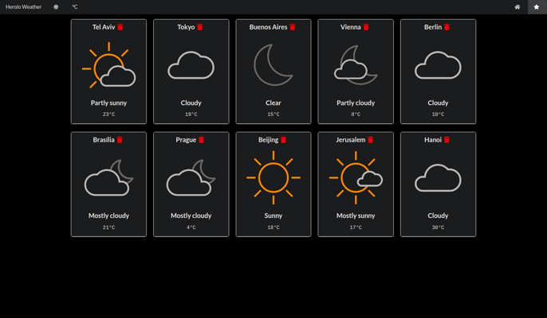

# Weather Task by Aharon Lubitsch

Weather app build with React + Redux






## Features

- Search for a city in the world and get its forecast
- Add a city to favorites (saved in localstorage)
- Get the forecast by user's geolocation
- Toggle dark\light mode (saved in localstorage)
- Toggle farenheit\celcius (saved in localstorage)

### Env Variables

Create a .env file in then root and add the following

```
REACT_APP_API_KEY=accuweather_api_key
```

### Install Dependencies

```
npm install
```

### Run

```
npm start
```

## Build

```
npm run build
```
